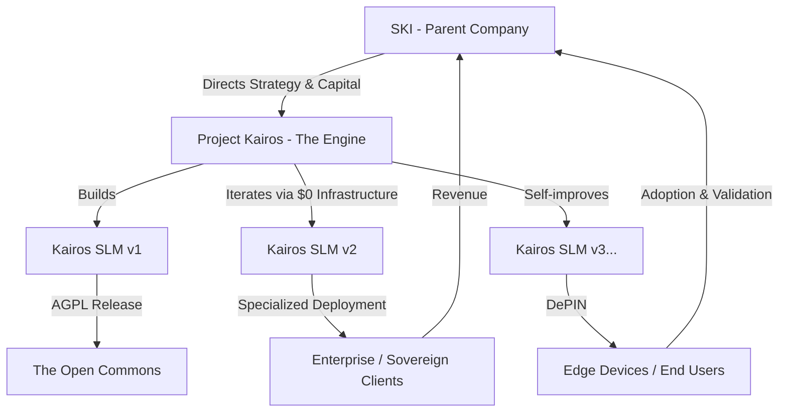

# Business Specification: The Unstoppable SLM Network

**Parent Entity:** SKI  
**Development Engine:** Project Kairos

## 1. Executive Summary

This specification outlines the commercial model for an entirely new paradigm of AI business. SKI provides **Sovereign Intelligence**—Small Language Models (SLMs) that are cheap to train ($0 CAPEX), impossibly light to run (<1GB RAM, using BitNet 1.58b), and legally unclaimable by the Big Tech ecosystem. 

Project Kairos, acting as the operational subsidiary under SKI, constantly churns out new versions of these models, ensuring the business is a moving target that cannot be tied down by IP trolls or centralized platform decay.

## 2. The "Unstoppable" Moat

Why is this business impossible for others to claim or destroy?

1.  **The Engine is Free:** Kairos utilizes Kaggle/Colab infrastructure to run knowledge distillation and DPO alignment. We do not own massive GPU clusters; therefore, we have no massive overhead to attack.
2.  **The Edge is Decentralized:** By compiling the inference engine in Rust via Candle and quantizing to 2-bits, the models run on the end-user's device (DePIN architecture). We do not host a central API server that can be shut down, DDoSed, or regulated out of existence.
3.  **AGPL-3.0 Shield:** The core Kairos inference protocol is open-sourced under the AGPL-3.0. If a major corporation attempts to steal the network infrastructure and sell it as a service, the license legally compels them to open-source their entire stack.
4.  **Constant Iteration:** Project Kairos is a factory. It does not produce a singular product (v1), it produces a constant stream (v1, v2, v3). You cannot patent or monopolize a rapid iteration cycle.

## 3. Revenue Streams (SKI)

If the models are free and the engine is open, how does the parent company make money?

### A. Sovereign AI Subscriptions (B2B)
Financial, legal, and healthcare entities cannot legally send sensitive data over an API to OpenAI or DeepSeek. 
*   **The Product:** SKI provides highly specialized, edge-deployed Kairos SLMs that run *inside* a company's secure intranet.
*   **The Fee:** Annual licensing and maintenance contracts for tailored architecture deployment.

### B. Hardware integration (IoT / Edge)
*   **The Product:** Licensing the sub-1GB RAM Rust inference engine to hardware manufacturers (drones, robotics, smart home devices) who need offline AI capabilities without battery drain.
*   **The Fee:** Per-device deployment fee or volume licensing.

### C. The Knowledge Factory
*   **The Product:** Using the autonomous Kairos pipeline to generate bespoke databases, RAG constraints, and custom SLMs on-demand for specific niches.
*   **The Fee:** Consulting and "Intelligence-as-a-Service" upfront payments.

## 4. Operational Pipeline

## 5. Next Steps for Implementation

1.  **Finalize the Kairos SLM v2 build** emphasizing the Rust/Candle architecture.
2.  **Deploy the first Sovereign Model** to a test device (e.g., a standard laptop or Raspberry Pi) to prove the <1GB RAM capability.
3.  **Establish the SKI landing page** differentiating the enterprise consulting wing from the open-source Kairos engine.
